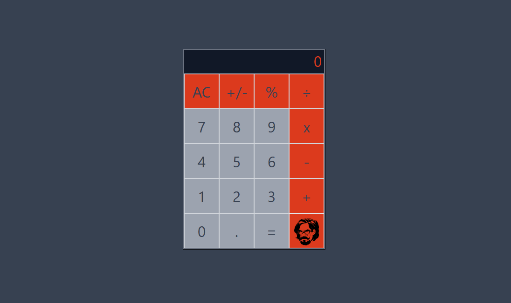

# Calculadora con React y Vite

Este proyecto es una calculadora web desarrollada utilizando las tecnologías fundamentales de HTML, CSS y JavaScript, con un enfoque moderno y eficiente gracias a React y Vite. La calculadora es capaz de realizar operaciones matemáticas básicas, brindando a los usuarios una herramienta funcional y fácil de usar.

## Características destacadas

- Desarrollado con React y Vite: Este proyecto se basa en React, una popular biblioteca de JavaScript para la creación de interfaces de usuario, y Vite, una herramienta de construcción de proyectos moderna que permite una configuración rápida y un rendimiento óptimo.

- Librerías Big y Tailwind: Para manejar números con alta precisión y estilizar la interfaz de usuario de manera eficiente, utilizamos la biblioteca "Big" para operaciones matemáticas y "Tailwind CSS" para el diseño y la estilización.

## Cómo utilizar

1. Clona este repositorio en tu máquina local.
2. Abre una terminal en el directorio del proyecto.
3. Ejecuta `npm install` para instalar las dependencias.
4. Ejecuta `npm run dev` para iniciar la aplicación en modo de desarrollo.
5. Abre tu navegador y visita `http://localhost:5173` para usar la calculadora.

## Contribuciones

Siéntete libre de contribuir a este proyecto. Puedes reportar problemas, sugerir mejoras o enviar solicitudes de extracción. ¡Esperamos colaborar contigo para hacer de esta calculadora una herramienta aún mejor!

## Licencia

Este proyecto está bajo la Licencia MIT. Siéntete libre de utilizar, modificar y distribuir el código de acuerdo con los términos de la licencia.

¡Gracias por calcular!

